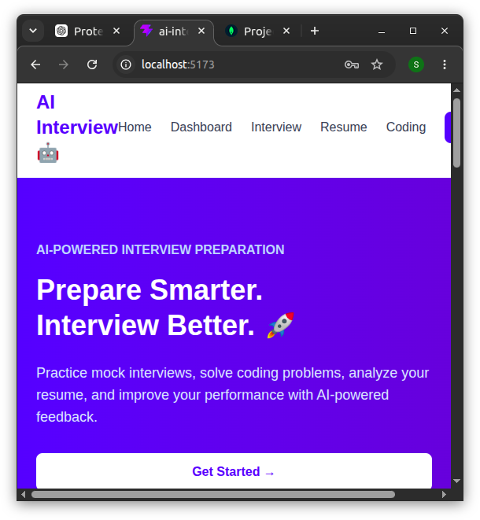
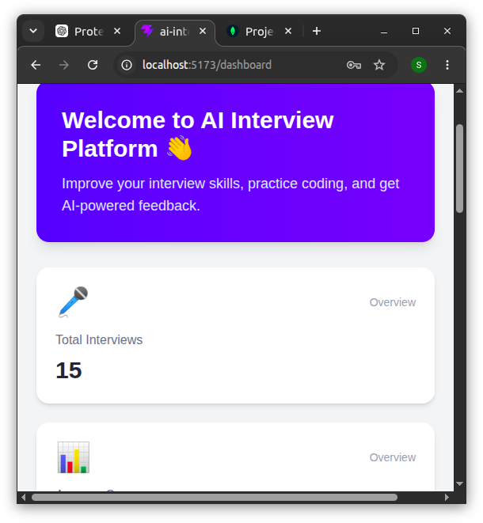
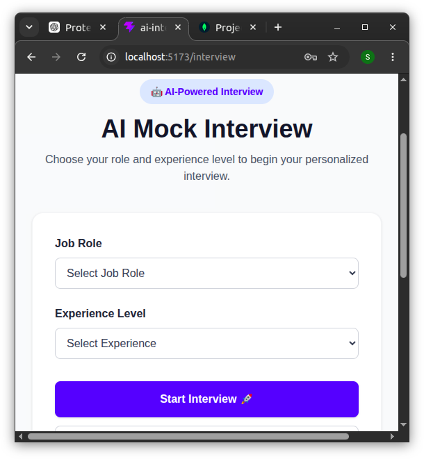
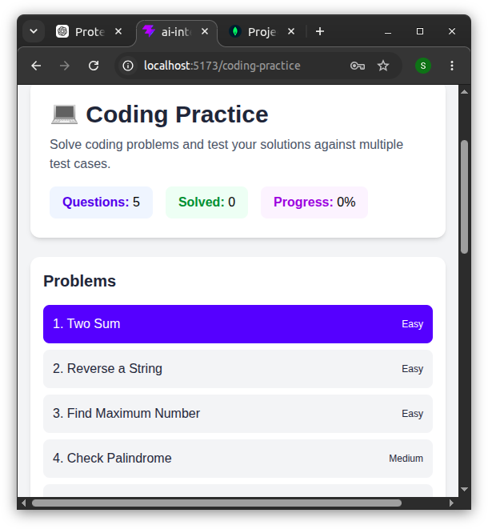
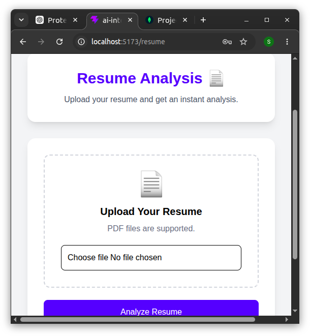

# 🤖 AI Interview Platform

An AI-powered interview preparation platform that helps students and job seekers practice technical interviews, solve coding problems, analyze resumes, and receive AI-powered feedback.

## 🚀 Features

* 🔐 **User Authentication**

  * User signup and login
  * JWT-based authentication
  * Protected routes
  * Logout functionality

* 🎤 **AI Mock Interviews**

  * Select job role
  * Select experience level
  * Practice technical interview questions
  * Submit answers for evaluation

* 🧠 **AI Answer Evaluation**

  * Answer scoring out of 100
  * Detailed AI feedback
  * Strengths identification
  * Areas for improvement

* 💻 **Coding Practice**

  * Multiple coding problems
  * Test coding solutions
  * Automatic result evaluation
  * Coding performance feedback

* 📄 **Resume Analysis**

  * Upload PDF resume
  * Extract resume text
  * Identify technical skills
  * Find missing skills
  * Resume score
  * Improvement suggestions

* 📊 **Dashboard**

  * Interview statistics
  * Coding practice overview
  * Resume score
  * Progress tracking
  * Quick access to platform features

## 🛠️ Tech Stack

### Frontend

* React.js
* Vite
* React Router
* Tailwind CSS

### Backend

* Node.js
* Express.js
* MongoDB
* Mongoose
* JWT
* bcrypt.js
* Multer

### AI & APIs

* OpenAI API
* Judge0 Code Execution API

### 📁 Project Structure

```text id="d0p4e8"
ai-interview-platform/
│
├── server/
│   ├── models/
│   ├── routes/
│   ├── uploads/
│   ├── Server.js
│   ├── package.json
│   └── package-lock.json
│
├── src/
│   ├── component/
│   │   ├── Navbar.jsx
│   │   └── ProtectedRoute.jsx
│   │
│   ├── pages/
│   │   ├── Home.jsx
│   │   ├── Login.jsx
│   │   ├── Signup.jsx
│   │   ├── Dashboard.jsx
│   │   ├── Interview.jsx
│   │   ├── Questions.jsx
│   │   ├── Results.jsx
│   │   ├── Resume.jsx
│   │   └── CodingPractice.jsx
│   │
│   ├── App.jsx
│   └── main.jsx
│
├── screenshots/
│   ├── home.png
│   ├── dashboard.png
│   ├── interview.png
│   ├── coding-practice.png
│   └── resume-analysis.png
│
├── package.json
└── README.md
```

## ⚙️ Installation

### 1. Clone the repository

```bash id="xj4q5m"
git clone git@github.com:shalinisingh62020-lang/ai-interview-platform.git
cd ai-interview-platform
```

### 2. Install frontend dependencies

```bash id="9y8c3v"
npm install
```

### 3. Install backend dependencies

```bash id="l5y7vp"
cd server
npm install
```

### 4. Configure environment variables

Create a `.env` file inside the `server` folder:

```env id="0d3bqh"
PORT=5000
MONGO_URI=your_mongodb_connection_string
JWT_SECRET=your_jwt_secret
OPENAI_API_KEY=your_openai_api_key
OPENAI_MODEL=your_openai_model
```

> ⚠️ Never commit your `.env` file or API keys to GitHub.

### 5. Start the backend

From the `server` folder:

```bash id="p5h2b6"
node Server.js
```

### 6. Start the frontend

Open another terminal in the project root:

```bash id="0x7f4q"
npm run dev
```

## 🔄 Application Flow

```text id="5u3f2a"
User
  ↓
Signup / Login
  ↓
Dashboard
  ↓
┌───────────────────────┐
│ AI Mock Interview     │
│ Coding Practice       │
│ Resume Analysis       │
└───────────────────────┘
  ↓
Performance & Feedback
```

## 📸 Project Screenshots

### 🏠 Home Page



### 📊 Dashboard



### 🎤 AI Mock Interview



### 💻 Coding Practice



### 📄 Resume Analysis



## 🔒 Security

* JWT-based authentication
* Password hashing using bcrypt
* Protected frontend routes
* Environment variables for API credentials
* `.env` excluded through `.gitignore`
* Secure handling of uploaded files

## 🎯 Future Improvements

* Real-time AI voice interviews
* Interview history
* Advanced performance analytics
* More programming languages
* Personalized interview recommendations
* Job-specific interview preparation
* Production deployment
* Improved AI-generated interview questions

## 👩‍💻 Author

**Shalini Singh**

B.Tech Computer Science Student

### Project

**AI Interview Platform**

A full-stack AI-powered interview preparation platform built using React, Node.js, MongoDB, and AI APIs.
